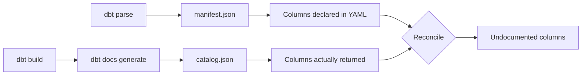

# dbt-governance-checks

Enforces two governance principles on a dbt Core project as a pull request gate:

1. **Tag coverage** — every model carries required tags, applied at any layer.
2. **Documentation completeness** — every column the model actually returns has a description and a data type, the model appears in YAML with a description, and key columns carry tests.

Reads dbt artifacts (`manifest.json`, `catalog.json`). Pure Python plus PyYAML, and it never imports dbt, so it is not coupled to your dbt release.

---

## Why artifacts rather than YAML files

dbt resolves config inheritance at **parse** time. By the time a model reaches `manifest.json`, `node.tags` already holds the merged set from:

- `dbt_project.yml`, including nested folder paths
- in-file `{{ config(tags=[...]) }}`
- the model's YAML entry

So "tags applied at any layer" is satisfied by reading one field. A tool that parsed YAML files directly would have to reimplement dbt's precedence rules, and would wrongly fail every model that inherits its tags from `dbt_project.yml`.

### The catalog is not optional for completeness

`manifest.json` records only the columns **declared in YAML**, not the columns a model returns. A model that documents nothing therefore satisfies every column-level rule vacuously:

```
dim_customers      columns in manifest: 0     <- passes every column rule
```

`catalog.json`, produced by `dbt docs generate`, supplies the real column list from `information_schema`. It is the only thing that closes that loophole, and it is why the CI job has to build changed models before checking them.

Verified against a real Snowflake build: Snowflake reports column names **upper-cased** while YAML is conventionally lower-case, so every comparison case-folds.



---

## Rule catalog

### Tags

| Rule | Meaning |
| --- | --- |
| `TAG001` | Model is missing a tag from a required group |
| `TAG002` | Model carries a tag outside the approved vocabulary |

`TAG002` matters more than it first appears. A misspelled `confidental` passes a presence check while leaving the model ungoverned, which is worse than a missing tag because it looks compliant.

### Documentation

| Rule | Meaning | Needs catalog |
| --- | --- | --- |
| `DOC001` | Model has no YAML entry at all | No |
| `DOC002` | Model has no description | No |
| `DOC003` | Model description is placeholder text | No |
| `DOC004` | Columns the model returns are undocumented | **Yes** |
| `DOC005` | Documented column has no description | No |
| `DOC006` | Column description is placeholder text | No |
| `DOC007` | Documented column has no `data_type` | No |
| `DOC008` | Key column carries none of the required tests | No |
| `DOC009` | Completeness could not be verified | **Yes** |
| `DOC010` | Description is shorter than the configured minimum | No |
| `EXEMPT001` | An exemption has expired | No |

`DOC001` short-circuits the other documentation rules, because they would all restate the same finding.

`DOC009` is deliberately an error rather than a skip. If a model is missing from the catalog because its build failed, silently skipping would switch off the strongest rule at exactly the moment it matters most.

---

## Configuration

All rules are configured in `governance_rules.yml`; see [governance_rules.example.yml](governance_rules.example.yml) for a documented template. Copy it into your dbt project root and edit.

Every rule accepts either a bare value or a mapping with `severity`:

```yaml
defaults:
  documentation:
    require_column_descriptions: true                    # error
    require_all_columns_documented: {severity: warning}  # reported, does not fail
    min_description_length: {value: 20, severity: error}
```

Severity is `error`, `warning`, or `ignore`. This is the adoption lever: land a rule as `warning`, clear the backlog, then promote it to `error`.

### Layer overrides

Keyed by the first directory beneath `models/`:

```yaml
layers:
  staging:
    documentation:
      require_all_columns_documented: {severity: warning}
```

An override supplying only `severity` inherits the default's value.

### Exemptions

```yaml
exemptions:
  - path: "models/legacy/**"
    reason: "Pre-governance backlog, tracked in AB-1234"
    expires: 2026-12-31
```

`expires` is **required**. An exemption with no expiry is never revisited, and the gate quietly erodes as the list grows. An expired exemption raises `EXEMPT001` and fails the build, forcing a deliberate decision to renew or remediate.

---

## Usage

```bash
pip install .

# Whole project
dbt-governance --project-dir /path/to/dbt/project

# Only models changed in this PR, which is how CI runs it
dbt-governance --project-dir . --changed-only --base-ref origin/main

# Skip completeness when no catalog is available
dbt-governance --project-dir . --catalog /dev/null --format console
```

| Flag | Purpose |
| --- | --- |
| `--project-dir` | dbt project root (default `.`) |
| `--manifest` | Override `target/manifest.json` |
| `--catalog` | Override `target/catalog.json` |
| `--rules` | Override `governance_rules.yml` |
| `--changed-only` | Restrict to models changed against `--base-ref` |
| `--base-ref` | Base ref for the diff (default `origin/main`) |
| `--format` | `console`, `annotations`, or `markdown` |
| `--output` | Also write the report to a file |
| `--warnings-as-errors` | Fail on warnings too |

Exit codes: `0` clean, `1` violations, `2` bad usage or unreadable artifacts.

---

## Change scoping

`--changed-only` uses `git diff --name-status <base>...HEAD` and matches paths against both `original_file_path` and `patch_path`.

Matching `patch_path` is essential. Deleting a column description from a shared `_models.yml` must be caught even though no `.sql` file changed, and because one schema file documents many models, a YAML edit correctly fans out to all of them.

Deleting a schema file outright is also handled: the deleted file no longer matches any node's `patch_path`, so the tool falls back to selecting models in that directory that now have no YAML entry.

This requires `fetch-depth: 0` on `actions/checkout`; a shallow clone has no base ref to diff against.

---

## Installation in CI

See [SETUP.md](SETUP.md). Two supported shapes:

- **Preferred** — a step in an existing slim CI job that already builds changed models.
- **Standalone** — call the reusable workflow, which does its own build.

The standalone path is simpler to adopt but rebuilds models the pipeline may have already built.

---

## Known gaps

**Declared `data_type` is not verified against the actual column type.** `DOC007` requires `data_type` to be *present*, not correct. If someone widens `varchar(50)` to `varchar(200)`, the declared type goes stale silently.

Closing this requires dbt model contracts (`contract: {enforced: true}`), which make dbt itself fail the build on a mismatch. That was considered and deliberately deferred to keep one configuration surface. Revisit if stale types become a real problem.

**Models only.** Sources, snapshots, and seeds also carry tags and column docs but are out of scope for v1.

**Column-level `meta` is not checked.** Only descriptions, data types, and tests. Add `require_column_meta_keys` if the stakeholder later asks for ownership metadata per column.

---

## Development

```bash
pip install -r requirements.txt -r requirements-dev.txt
python -m pytest tests/ -v
ruff check dbt_governance tests scripts
```

`fixtures/dbt_project/` is a real, buildable dbt project engineered so that every rule fires at least once and every inheritance edge case is exercised. `tests/test_golden.py` pins the exact expected violation set, so a regression in any rule fails loudly.

It is a seed-to-staging-to-marts pipeline: three seeds stand in for raw source tables, staging models select from them, and marts models select from staging. Seeds contribute no violations, because the checker only evaluates models.

### Regenerating the fixture artifacts

```bash
# Manifest only. No warehouse needed.
scripts/rebuild_fixture.sh parse

# Manifest plus a real catalog, built against a Snowflake CLI connection.
scripts/rebuild_fixture.sh build <connection-name>
```

The committed `fixtures/manifest.json` is real `dbt parse` output, so tests run without dbt installed, while CI re-parses to catch drift.

`fixtures/catalog.json` is genuine `dbt docs generate` output from a real Snowflake build, not a hand-written stub. That matters: it is what proves the column-name case folding is correct rather than assumed, since Snowflake returns names upper-cased.

Two models are deliberately kept out of the catalog:

| Model | Why absent | Expected result |
| --- | --- | --- |
| `dim_not_built` | Excluded from the build, simulating a failed build | `DOC009` error |
| `int_ephemeral_documented` | Ephemeral, so never materialized | No violation |

The build exclusion in `scripts/rebuild_fixture.sh` is load-bearing. Removing it makes `dim_not_built` appear in the catalog and silently deletes the `DOC009` test case.

**Command differs by dbt distribution.** dbt Core 1.7-1.9 uses `dbt docs generate`; dbt Fusion 2.x replaced it with `dbt compile --write-catalog`. The rebuild script tries both. The CI workflow uses `dbt docs generate`, which is correct for the dbt Core versions this tool targets.
